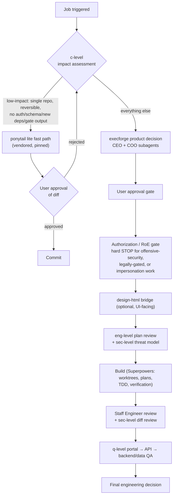

<h1 align="center">ExecForge</h1>

<p align="center"><em>Governed software delivery for AI agents — from product decision to ship verdict, with evidence at every gate.</em></p>

<p align="center">
  <a href="https://github.com/v3x5exia555/execforge/actions/workflows/ci.yml"></a>
  
  
  
  
</p>

| | |
|---|---|
| **What** | Agent-skill platform governing a software initiative from **product decision** through **engineering, security, and cross-layer QA** to a final ship decision |
| **Entry points** | One governed end-to-end run (`full-cycle`), any single stage, or the low-impact fast path |
| **Invariant** | Never claim a review, test, approval, or lifecycle stage ran without evidence that it actually ran |
| **Harnesses** | Claude and Codex plugin manifests; Agent Skills directory convention |

## Contents

- [Lifecycle](#lifecycle)
- [Bundled skills](#bundled-skills)
- [Optional integrations](#optional-integrations)
- [Requirements](#requirements)
- [Quick start](#quick-start)
- [Actor parameters](#actor-parameters)
- [CLI reference](#cli-reference)
- [Initiative-scoped operating state](#initiative-scoped-operating-state)
- [Evaluations](#evaluations)
- [Continuous integration](#continuous-integration)
- [Decision boundaries](#decision-boundaries)

## Lifecycle

Every job enters through the `c-level` router. Low-impact jobs may take the fast path; everything else runs the governed pipeline.



Product decisions set **initiative flags** (`offensive-security`, `legally-gated`, `regulated-impersonation`, `user-prescribed-mechanism`) that arm conditional gates downstream — most importantly an Authorization / Rules-of-Engagement gate that stops legally-gated or offensive-security work until the operator records an authorization decision. See [Authorization Gate](docs/authorization-gate.md).

## Bundled skills

| Skill | Purpose |
|---|---|
| `c-level` | Bootstrap/router that selects the correct workflow and integrates installed Superpowers skills |
| `full-cycle` | End-to-end lifecycle orchestrator: product decision → approval → design → plan → build → reviews → QA → final ship verdict in one governed run |
| `execforge` | CEO + COO product pressure test and final `GO / MODIFY / PILOT / DEFER / KILL` decision |
| `design-html` | Translates approved product scope into UX/interface structure and production-oriented HTML/CSS guidance for UI-facing work, optionally binding an external design system via `--design-system` |
| `eng-level` | Upstream approval, engineering plan review, implementation conformance, Staff Engineer review, and final ship decision |
| `q-level` | Risk-based portal/API/backend QA planning, execution, retest, data-QA attachment, and `QA PASS / RETURN / BLOCK` decision |
| `sec-level` | Application-security actor: threat model at plan stage, OWASP-mapped adversarial review of the real diff, and `SEC PASS / FIX REQUIRED / BLOCK` verdict |

Each skill follows the Agent Skills directory convention: a concise `SKILL.md` entry point, detailed contracts under `references/`, and reusable templates under `assets/`.

## Optional integrations

ExecForge integrates external skills in two ways — referenced when separately installed, or vendored as a pinned snapshot — and never forks or auto-updates them. Absent integrations leave their router rows inert.

| Integration | Role | Contract |
|---|---|---|
| [Superpowers](https://github.com/obra/superpowers) | Implementation discipline: worktrees, written plans, TDD, verification-before-completion | Referenced by `c-level` and `eng-level`; install via its official instructions and check with `check-superpowers` |
| [Ponytail](https://github.com/DietrichGebert/ponytail) | Generation-time simplicity persona powering the **low-impact fast path** | Vendored verbatim in [`skills/ponytail/`](skills/ponytail/), pinned to the upstream commit recorded in [`PROVENANCE.md`](skills/ponytail/PROVENANCE.md); never fetched at runtime, never via auto-updating plugin |

### The low-impact fast path

When a triggered job is **low-impact** — single repo, reversible in one revert, no auth/secrets/trust-boundary/schema/data-migration surface, no new dependency, no governance gate output — `c-level` routes it around the full pipeline:

1. `ponytail lite` implements the job (smallest correct diff; stdlib and native platform first).
2. Precedence holds: Superpowers TDD wins over ponytail on test discipline; gate outputs are never shortened or skipped.
3. The run is logged to the operator's pilot observation ledger when one is configured.
4. The diff summary is presented to the user for **explicit approval before any commit**. No approval, no commit.

Any doubt about impact means not low-impact: the job takes the normal governed pipeline. Full criteria live in [`skills/c-level/SKILL.md`](skills/c-level/SKILL.md).

The repository also includes:

- A dependency-free Python CLI for validation, environment checks, installation, run initialization, and status
- JSON schemas for decision and lifecycle state artifacts
- Behavioral evaluation cases for every bundled skill
- Static tests and GitHub Actions CI
- A MkDocs wiki with a GitHub Pages deployment workflow
- Cross-harness plugin manifests (Claude and Codex)
- Example decision artifacts for every lifecycle stage
- Superpowers integration guidance without vendoring or modifying Superpowers

## Requirements

- **Python ≥ 3.9** — the CLI has no third-party dependencies.
- **Git** — needed by `eng-level` for diff review (optional for the CLI itself).
- **MkDocs** (optional) — only to build the documentation site: `python3 -m pip install -r requirements-docs.txt`.

Check your environment at any time:

```bash
python3 scripts/execforge.py doctor
```

## Quick start

### 1. Validate and check the environment

```bash
python3 scripts/execforge.py validate
python3 scripts/execforge.py doctor
python3 scripts/execforge.py doctor --installed
python3 scripts/execforge.py doctor --portfolio ~/Desktop/project
python3 -m unittest discover -s tests -v
```

`doctor --installed` compares the bundled skills with known user installations.
`doctor --portfolio` scans only direct-child Git repositories for instruction,
Git, selector, and lifecycle-state problems; diagnostics are read-only.

### 2. Install the skills

Installation validates the bundle first and verifies every installed skill afterwards.

```bash
# Project-local
python3 scripts/execforge.py install --destination .claude/skills

# User-level Claude installation
python3 scripts/execforge.py install --target claude

# User-level Codex installation
python3 scripts/execforge.py install --target codex
```

Add `--force` to overwrite an existing installation.

### 3. Check optional Superpowers integration

```bash
python3 scripts/execforge.py check-superpowers
```

Install Superpowers separately using its official instructions. ExecForge references Superpowers skills when present; it does not copy or fork their content.

### 4. Start with a product decision — or run the whole lifecycle

For one governed end-to-end run (all stages, both user gates):

```text
/full-cycle Take this from idea to ship:
[problem, target user, proposed change, constraints, evidence]
```

Or enter stage by stage, starting with the product decision:

```text
/execforge Review this initiative:
[problem, target user, proposed change, constraints, evidence]
```

### 5. Optional UI/UX design bridge

For UI-facing initiatives with approved scope:

```text
/design-html
```

`design-html` owns structure, not aesthetics. To bind a visual language, pass a design system from the [awesome-design-skills](https://github.com/bergside/awesome-design-skills) registry:

```text
/design-html --design-system=brutalism
```

The interface contract still wins: approved scope, then screens and states, then accessibility, then design system tokens. A token that fails the contrast bar is reported, never silently applied or silently overridden.

### 6. Move to engineering

```text
/eng-level --mode=auto
```

The lifecycle stops at `UPSTREAM_APPROVAL_REQUIRED`. Approve the interpreted requirements with `APPROVE UPSTREAM`.

If the initiative carries a gating flag (`offensive-security`, `legally-gated`, or `regulated-impersonation`), it stops again at the **Authorization / Rules-of-Engagement gate** before any build. Record an `AUTHORIZED` / `NOT AUTHORIZED` / `N-A (justified)` decision with written authorization, scope of engagement, consent basis, no unapproved third-party impersonation, and captured-data handling. This is a governance gate the agent never self-answers, distinct from the `sec-level` technical review — see [Authorization Gate](docs/authorization-gate.md).

### 7. Build and review

When Superpowers is installed, the recommended implementation path is:

```text
using-git-worktrees
→ writing-plans
→ subagent-driven-development or executing-plans
→ test-driven-development
→ verification-before-completion
```

ExecForge then performs the Staff Engineer review against the real diff, runs the portal/API/backend QA gate, and requires a final delta review when QA fixes production code.

### 8. Attach the security actor when it applies

For changes touching auth, user input, secrets, sensitive data, new dependencies, or network exposure:

```text
/sec-level --mode=auto
```

`auto` runs a threat model before implementation and an OWASP-mapped review once a real diff exists. An unresolved `S0`/`S1` finding blocks shipping like a `P0`/`P1`.

### 9. Run the QA gate

```text
/q-level --mode=auto
```

Approve the proposed test plan and target environment with `APPROVE QA PLAN`.

## Actor parameters

Parameters passed when you trigger an actor. Every parameter is optional.

| Actor | Parameter | Values | If omitted |
|---|---|---|---|
| `/c-level` | *none* | Router; selects the workflow and forwards parameters to it | — |
| `/full-cycle` | `--design-system` | Forwarded to `design-html` at Stage 2 (see below) | Stage 2 runs aesthetic-neutral |
| `/execforge` | *none* | Depth is chosen internally: one isolated review for small, low-risk, reversible changes; dual CEO + COO subagents otherwise | — |
| `/design-html` | `--design-system` | `<name>` \| `auto` \| `none` | `none` |
| `/eng-level` | `--mode` | `plan` \| `review` \| `full` \| `auto` \| `status` | Pass `auto` to detect the next valid stage |
| `/q-level` | `--mode` | `plan` \| `execute` \| `full` \| `retest` \| `auto` \| `status` | Pass `auto` to detect the next valid stage |
| `/sec-level` | `--mode` | `threat-model` \| `review` \| `auto` | Pass `auto` to pick from lifecycle evidence |

Only `design-html` declares a default for an omitted parameter (`none`). `eng-level`, `q-level`, and `sec-level` document their modes but do not declare a default — pass `--mode=auto` explicitly, as the quick start does, rather than relying on inference.

### What each value does

**`design-html --design-system`** binds an external visual language to the interface contract. `none` produces aesthetic-neutral structural HTML/CSS. `<name>` resolves against the [awesome-design-skills](https://github.com/bergside/awesome-design-skills) registry and binds its tokens. `auto` proposes a system and confirms before binding. Structure, screen states, and accessibility always outrank design system tokens — a design system may restyle a state but never remove one, and it never adds scope. See [design system binding](skills/design-html/references/design-system-binding.md).

**`eng-level --mode`** — `plan` approves or rejects the technical plan; `review` audits a real Git diff; `full` runs every stage possible in the session; `auto` detects and runs the next valid stage; `status` reports state without starting a review.

**`q-level --mode`** — `plan` creates a risk-based QA plan and stops for approval; `execute` runs an already approved plan; `full` plans, requests approval, then executes; `retest` verifies fixes without silently reducing expectations; `auto` detects and runs the next valid stage; `status` reports state and open defects.

**`sec-level --mode`** — `threat-model` runs at plan stage before implementation; `review` runs an OWASP-mapped audit once a real diff exists; `auto` picks from lifecycle evidence (no diff yet → `threat-model`; real diff exists → `review`).

### Not parameters

Two things look like parameters but are not passed at invocation:

- **Initiative flags** (`offensive-security`, `legally-gated`, `regulated-impersonation`, `user-prescribed-mechanism`) are *set by* `execforge` as an output of the product decision. They arm conditional gates downstream; you do not pass them in.
- **Gate responses** (`APPROVE UPSTREAM`, `APPROVE QA PLAN`, `AUTHORIZED` / `NOT AUTHORIZED` / `N-A (justified)`) are replies to a stopped lifecycle, typed when the actor asks. The agent never self-answers them.

### Examples

```text
/design-html --design-system=brutalism
/full-cycle --design-system=auto Take this from idea to ship: [problem, user, change, constraints]
/eng-level --mode=review
/q-level --mode=retest
/sec-level --mode=threat-model
```

## CLI reference

All commands run through `scripts/execforge.py` (or `scripts/install.sh` as a thin wrapper around `install`).

| Command | Purpose |
|---|---|
| `validate` | Check repository structure, skill frontmatter, link integrity, manifests, and schemas |
| `doctor` | Check Python version, repository integrity, Git/MkDocs availability, install-target writability, and Superpowers presence |
| `install --target claude\|codex\|agents` or `--destination <dir>` | Validate, copy, and verify the skill bundle (`--force` to overwrite) |
| `check-superpowers` | Detect a separately installed Superpowers setup |
| `doctor --installed` | Compare bundled skills with every known install root and report missing or drifted files |
| `doctor --portfolio <path>` | Read-only scan of direct-child Git repositories for instruction, Git, selector, and lifecycle-state findings |
| `init-run --name <initiative> [--root <repo>]` | Seed a new initiative-scoped product, engineering, and QA run and select it (`--name` must be a single line, non-empty after trimming, and at most 512 characters) |
| `status [--root <repo>]` | Report current engineering and QA lifecycle state and backlog |
| `resume [--root <repo>]` | Reconcile selected lifecycle metadata with the repository's current Git branch and HEAD |
| `next [--root <repo>]` | Print exactly one safe next lifecycle action; unsafe or stale state exits nonzero |
| `eval [case-id\|all] [--list] [--limit N]` | Execute behavioral eval cases: replay the scenario through a headless agent (`--agent-cmd`, default `claude -p`), grade the transcript with an LLM judge (`--judge-cmd`), and recompute the verdict locally |
| `release-check [--tag vX.Y.Z]` | Verify plugin manifests, changelog version, and optional release tag agree |

Typical operating checks and re-entry commands are:

```bash
python3 scripts/execforge.py doctor --installed
python3 scripts/execforge.py doctor --portfolio ~/Desktop/project
python3 scripts/execforge.py resume --root <repo>
python3 scripts/execforge.py next --root <repo>
```

## Initiative-scoped operating state

`init-run` creates matching run IDs under `.execforge/runs/<run-id>`,
`.eng-level/runs/<run-id>`, and `.q-level/runs/<run-id>`. The authoritative
selector is `.execforge/current.json`; `.eng-level/current.json` and
`.q-level/current.json` are compatibility projections for existing readers.
The selector is a rebuildable index, not stronger evidence than runtime
behavior, tests, code, Git history, or the run artifacts themselves.

Legacy root state remains readable only when no safe current selector can be
used. ExecForge never silently migrates or deletes those legacy artifacts.
The stable, Git-ignored `.execforge-init-run.lock` coordinates concurrent
initialization; retaining the same file keeps its lock inode stable between
runs.

`resume` reports bounded metadata, evidence/backlog locations, and safe warning
codes. `next` prints one derived action. Neither command prints the raw recorded
`next_action`, blocker contents, or unescaped terminal control characters.
Conflicts, unreadable state, stale branch/commit lineage, or blockers stop
progress; reaching a `stop_after` boundary waits for an explicit user
instruction. See [Getting Started](docs/getting-started.md) and the
[Eng Level state contract](skills/eng-level/references/state-and-artifacts.md)
for lineage, exit-status, privacy, and rollback details.

## Evaluations

`evaluations/` contains at least one behavioral evaluation case per bundled skill — plus focused cases for conditional behavior such as the Authorization gate and design system binding. Each case carries an input scenario, an expected-behavior checklist, and explicit failure conditions. A case passes only when every expected behavior is observed and no failure condition occurs. The shared invariant across all cases: **never claim a review, test, approval, or lifecycle stage ran without evidence that it actually ran.** See [`evaluations/README.md`](evaluations/README.md).

Cases are executable: `python3 scripts/execforge.py eval` runs them through a headless agent and grades the transcript. An advisory CI job runs a capped set on skill changes when an `ANTHROPIC_API_KEY` repository secret is configured, and skips cleanly when it is not.

## Continuous integration

GitHub Actions runs on every push and pull request ([`.github/workflows/ci.yml`](.github/workflows/ci.yml)):

1. `python3 scripts/execforge.py validate`
2. `python3 scripts/execforge.py doctor`
3. `python3 -m unittest discover -s tests -v`
4. `python3 scripts/execforge.py release-check`
5. `mkdocs build --strict`

Three more workflows:

- [`docs.yml`](.github/workflows/docs.yml) deploys the MkDocs site to GitHub Pages on pushes to `main`. Enable **Settings → Pages → Source: GitHub Actions** to publish it.
- [`evals.yml`](.github/workflows/evals.yml) runs a capped behavioral-eval set on pull requests that touch `skills/`, `evaluations/`, or the CLI. Advisory: it cannot block a merge, and it skips without an `ANTHROPIC_API_KEY` secret.
- [`release-gate.yml`](.github/workflows/release-gate.yml) runs `release-check --tag` on every pushed `v*` tag, so a tag that disagrees with the manifests or CHANGELOG fails visibly.

## Documentation

The full guide lives under [`docs/`](docs/index.md). Build it locally:

```bash
python3 -m pip install -r requirements-docs.txt
mkdocs serve
```

## Repository layout

```text
execforge/
├── skills/              # Bundled skills (SKILL.md + references/ + assets/)
│   ├── c-level/
│   ├── design-html/
│   ├── execforge/
│   ├── eng-level/
│   ├── full-cycle/
│   ├── ponytail/        # Vendored third-party simplicity persona (pinned; see its PROVENANCE.md)
│   ├── q-level/
│   └── sec-level/
├── evaluations/         # Behavioral evaluation cases, one per skill
├── docs/                # MkDocs wiki source
├── examples/            # Example decision artifacts
├── schemas/             # JSON schemas for decision/state artifacts
├── scripts/             # Dependency-free CLI and install wrapper
├── tests/               # Static repository and bundle tests
├── .claude-plugin/      # Claude plugin manifest
├── .codex-plugin/       # Codex plugin manifest
└── .github/workflows/   # CI and docs deployment
```

## Decision boundaries

Full Cycle answers:

> Has every lifecycle stage for this initiative run in order, with evidence, through both user gates, to a single final verdict?

ExecForge answers:

> Should we build this, and what is the smallest defensible scope?

Design HTML answers:

> Given approved scope, what is the smallest clear interface that delivers the user outcome and can be implemented faithfully?

Eng Level answers:

> Does the approved engineering plan and actual implementation satisfy the approved product requirements safely enough to ship?

Q Level answers:

> Does the critical business transaction work across portal, API, and backend/data with release-quality evidence, including persisted-state risk where data QA is required?

Sec Level answers:

> Can an attacker abuse this change — proven against the actual code, configuration, and dependencies, not the plan's stated intent?

The Authorization gate answers:

> Are we permitted to perform this operation at all — with written authorization, a defined scope, a consent basis, and no unapproved impersonation — before any of it is built?

Superpowers answers:

> How should the coding agent execute the approved implementation with disciplined planning, isolation, TDD, review, and verification?

## Versioning and releases

Releases follow semantic-style `MAJOR.MINOR.PATCH` versions, tagged as `v<version>` in Git, with plugin manifests and skill frontmatter kept in sync. Changes are recorded in [CHANGELOG.md](CHANGELOG.md).

## Contributing and security

See [CONTRIBUTING.md](CONTRIBUTING.md) for the contribution workflow and [SECURITY.md](SECURITY.md) for reporting security issues.

## License

MIT. See [LICENSE](LICENSE).
